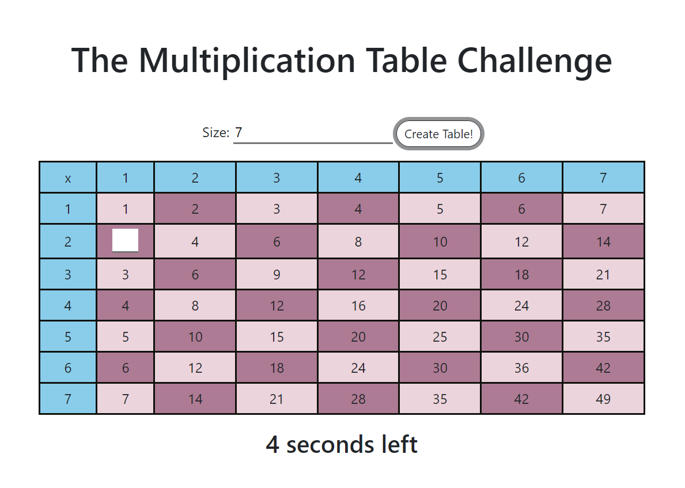

# JavaScript Multiplication Table

Generate a multiplication table of nxn cells, n is the number you input in. A random cell will be left blank and you have some seconds to quickly calculate the number that should go into the cell. This serves as a programming assignment for my Web Dev course

## Installation & Usage

Clone this repository to your machine and run index.html.

## Problems

The timer doesn't start when the user play again without reloading the page.

## Contributing
Pull requests are welcome. For major changes, please open an issue first to discuss what you would like to change.

Please make sure to update tests as appropriate.
